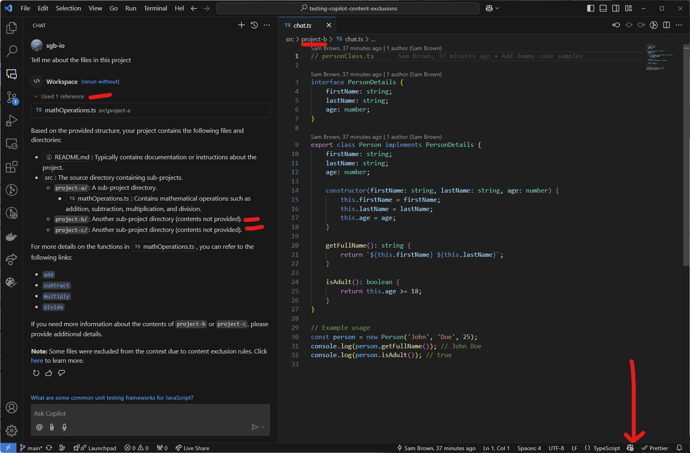

# testing-copilot-content-exclusions

Demonstrates excluding content from _any_ git repo for use wth **GitHub Copilot Business**.

**Note:** This example uses a GitHub-hosted repository, but the exlusion settings allow you to specify any Git repo.

## Demo

This demo contains 3 "projects" and the intention is:

- `src/project-a`: is ALLOWED for use with GitHub Copilot
- `src/project-b`: is EXCLUDED for use with GitHub Copilot
- `src/project-c`: is EXCLUDED for use with GitHub Copilot

The Content Exclusions settings:

The GitHub Copilot IDE Plugin then respects my settings.

Observe how Copilot has access to `project-a`, but not `project-b` or `project-c`.

